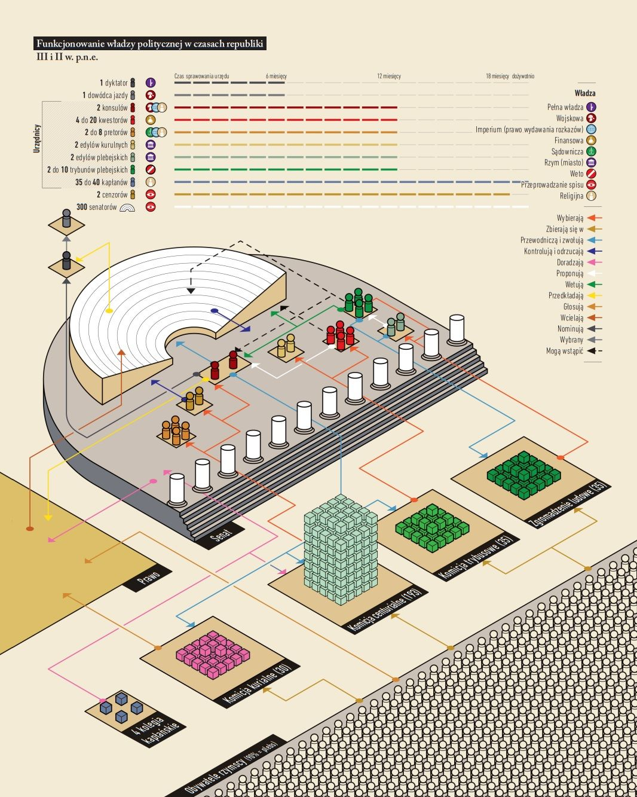

# Wykład 1: Ramy czasowe
## Zaliczenie 
Egzamin
    Wykład + trzy lektury (książka + artykuł + źródło) ,,część tekstów postaram się żeby była obecne w formie elektronicznej''
    Pytania zwykle są cztery na egzaminie (trzy z lektur, jedno z wykładu)
Obecność
    Każdy kto będzie miał więcej niż dwie nieobecności będzie musiał przygotować więcej lektur (jedna nieobecność = jedna lektura)
## Lektury
Książki pomocnicze (nie podręczniki) ,,W języku polskim nie mamy de facto dobrego podręcznika do republiki rzymskiej.'' 
    Klaus Bringmann, Historia republiki rzymskiej od początków do czasów augusta, Poznań 2010
    Adam Ziółkowski, Historia Rzymu, Poznań 2004/2008
    H.H. Scullard, M. Cary. Dzieje Rzymu, t.I, Warszawa 1992/2001 (naukowe podejście do procesów historycznych budzi wątpliwości)
    T. Łoposzko, Historia społeczna republikańskiego Rzymu, Lublin 1987
    G. Alfoldy, Historia społeczna Rzymu, Poznań 2010
    Starożytny Rzym we współczesnych badaniach, praca zbiorowa Kraków 1994 (można sobie któryś artykuł z tej książki wybrać na lekturę)
Rozważania ,,Dlaczego?'':
    Monteskiusz, Rozważania o przyczynach wielkości rzymian i o ich upadku
    A. Toynbee, Hannibal's Legacy, Cambridge 1965 (Toynbee uważał, że to właśnie druga wojna punicka była początkiem tych wszystkich procesów które doprowadziły do upadku Rzymu)
    H. Flower, Roman Republics, Princeton 2011 (uznała, że mamy do czynienia z wieloma republikami - system republikański przechodził ewolucję)
    R. Syme, Roman Revolution, Oxford 1939 (pisał w okresie kiedy wybuchała druga wojna światowa, dążenie do władzy tych przywódców było silne, tak więc oktawiana widzimy przez pryzmat jego czasów)
    Empire, Hegemony or Anarchy? Rome and Italy, 201-31 BCE, Stuttgart 2019
Kilka przykładów źródeł:
    Marek Tulliusz Cyceron, Marcus Tullius Cicero (106-43 p.n.e.) ,,Epistulae ad Atticum''; ,,Epistulae ad Quntum fratrem''; ,,Epistulae ad familiares'' orationes; ,,Werrynki'', ,,Katylinarki'', ,,Filipki'' 
    Gajusz Salustiusz Kryspus, łac,. Caius Sallustius Crispus (86-35 p.n.e.) ,,De Catilinae conjuratione'', ,,Belum Iugurthinum'', ,,Historiae'' 
    Gajusz Juliusz Cezar, Caius Iulius Caesar (104-44 p.n.e.) ,,Commentarii rerum gestarum de belli Gallici'', ,,Commentarii rerum gestarum de belli civilis''
    Polibiusz z Megalopolis ,,Dzieje''
    Plutarch z Cheronei, Ploutarchos (50-120 n.e.) ,,Żywoty równoległe'' : Tyb. i G. Grakchowie, G. Mariusz, L. Sulla, Kw. Sertoriusz, Gn. Pompejusz, G. Cezar, M. Cyceron, G. Katon, M. Krassus, L. Lukullus, M. Brutus, M. Antoniusz 
    Appian z Aleksandrii, ,,Historia Rzymska'' Księga XIII i XIV. 
    Kasjusz Dion Kokcejanus ,,Historia Rzymska''
    Tytus Liwiusz Patawianus, Titus Livius Patavianus ,,Historia Rzymu od założenia miasta'' (ab Urbe condita)
Skupiamy się głównie na procesach, pytania czemu to się wydarzyło w tym konkretnym okresie. Dlaczego jedynowładztwo stało się rozwiązaniem dla problemów republiki? Warunki które sprawiły że wielkie postaci mogły zaistnieć. 
## Źródła
Jest ich dużo ale nie wszystkie są zachowane
Grecy opisywali ten okres jakiś czas później, w konwencji opisu konfliktów poleis greckich (,,jest to najbardziej grecki okres rzymu'') - trzeba być ostrożnym oceniając źródła 

Co to znaczy być rzymianinem?
Dlaczego tak świetnie prosperujące państwo prowadziło tyle wojen. Czy aby to ta ekspansja nie miała wpływu na to, że ustrój republikański musiał ulec przekształceniu?

Momentem przełomowym republiki było wystąpienie Tyberiusza Grakka. Ale był to jedynie owoc wcześniejszych sporów wewnętrznych. 

# Wykład 2: Ustrój republiki rzymskiej

W rzymie nie było ustawy zasadniczej która regulowałaby kwestie ustrojowe. Te rzeczy zależą bardziej od zwyczaju/precedensu. Nawet prawa XII tablic nie można traktować jako takiej ustawy zasadniczej.
Spray ustrojowe podlegały ewolucji. Wiele cech republiki miało swoje korzenie w monarchii. ,,Otium regium'' - nienawiść do jedynowładztwa
Rzymianie uważali że ich ustrój jest najlepszym z możliwych. Od greków różnili się tym, że Grecy myśleli że za ustrojami stały jakieś wybitne jednostki. Rzymianie twierdzili że ustrój stworzyli po prostu ich przodkowie.
Uważali, że państwo z lepszym ustrojem wygra.
Źródła traktujące o zmianie monarchii nie są zbyt wiarygodne.
Fragment z polibiusza, gdzie wnioskiem jest to, że najlepszy jest ustrój mieszany. 

Lud rzymski nie zbierał się na zgromadzenia często, ciężko było zwoływać taki tłum ludzi.
Kalendarz rzymski nie wspierał również obrad - było dużo dni w których nie wolno było obradować. 
Kiedy rzym wyszedł poza Lacjum, lud nie do końca był w stanie ogarnąć tyle spraw.
O tym kiedy zwoływano zgromadzenie decydował urzędnik. Contio, contiones - nieoficjalne spotkania ludu (jeśli nie było na nim urzędnika to było to podejrzane). 
W rzymie głosowano kuriami, centuriami, tribusami - nie pojedynczym obywatelem.

## Zgromadzenia
Zgromadzenie kurialne:
Nie do końca wiemy jaką miało funkcję
Państwo rzymskie było wieloetniczne, był w nim podział na ważne rody (ród niekoniecznie znaczy to samo co klan).  
Zgromadzenie kurialne było oparte o rody. U zarania było już około 30 kurii, a w każdej kurii kilkanaście rodów. 
W republice zgromadzenie kurialne decydowało o urzędnikach którzy mieli imperium - władzę i kompetencje (konsul i pretor). 
Mamy głównie przedstawicieli rodów i to tych najważniejszych.

Zgromadzenie centurialne:
Jest wynikiem przemian społeczeństwa rzymskiego (rośnie nacisk udziału obywateli w wojsku/centuriach)
193 centurie stanowią odzwierciedlenie społeczeństwa rzymskiego - w nich mamy jeszcze 5 warstw majątkowych.
18 centurii jazdy - equites
80 centurii I klasy majątkowej
Są to klasy najbogatsze i to one miały najwięcej do powiedzenia.
Mamy do czynienia ze społeczeństwem timokratycznym - majątek ma znaczenie.

Zgromadzenie Trybusowe:
Też jest dziedzictwem monarchii. Pomysł stworzenia zgromadzenia trybusowego wziął się od Sergiusza Trybusza - wynikał z konkretnego podziału ziem rzymskich.
Pierwsze cztery trybusy to były trybusy miejskie
?498? - pojawiają się trybusy wiejskie - mamy ich razem 19. 
241 - powstają wtedy ostatnie 2, łącznie mamy wtedy 35 tribusów.

Zgromadzenie concilium plebis (zgromadzenie ludowe):
Powstało już w okresie republikańskim. 
Zasiadali w nim plebejuse, nie znaczy to że nie było ich też w innych zgromadzeniach, ale mieli swoje.
Zgromadzenie ludowe działało jako instytucja która wydawała ustawy wtedy nazywane ,,plebiscitum'', które dotyczyły różnych rozwiązania dotyczących plebejuszy.
200 lat później zajmowali sie już ustawami dla wszystkich.
Ustawy nazywamy ,,leges'' - najwyższy element decyzyjny w Rzymie. 
Zgromadzenia były również sądami. 

## Senat Rzymski i religia
Senat pochodzi od słowa senex - rady starszych
Senat nadawał taki ,,placet'' - czyli poparcie 
Urzędnicy rzymscy mieli kompetencje żeby komunikowac się z bogami. 
Religia była ważna w rzymie. 
W okresie schyłku republiki używano religii instrumentalnie.
Gajusz pompejusz nie podobała mu się decyzja ludu i jako augur mówi że usłyszał grzmot pomimo tego że pogoda była ładna i przerwano obrady.
Senat miał prawo decydować czy dana ustawa jest zgodna z tym co myśleli bogowie.
Senatores Pedarii - 
Senat zaczął zastępować zgromadzenia w niektórych kompetencjach
Senat np decydował o tym jakie pieniądze przeznaczymy na działanie armii rzymskiej w hiszpanii, jakich posłów przyjąć
Senatus consulta - uchwały senatu. 
Zabrał też kompetencje sądownicze. Stało się tak bo był a to instytucja która mogła się spotkać w każdej chwili i podjąć decyzję. 

# Wykład 3: Ustrój part 2 - strefy najwyższe
Magistratura rzymska jest raczej republikańska - powstała po to aby zastąpić władcę. 
Stąd dwie zasady urzędów - kolegialność (mamy dwóch konsulów, ale zawsze ważniejszy był ten konsul który był wybrany jako pierwszy - z większą ilością głosów). 
Konsul to pojęcie dosyć późne, pojawia się w IV. Słowo *naczelnik* pojawia się w V/VI w. i chodzi o pretorów. 
Różne zgromadzenia wybierały różnych urzędników
*Imperium* - moc wydawania rozkazów
*provincia* - zakres kompetencji urzędnika

## Pretor
liczba pretorów zwiększa się bo stoją oni na czele wszystkich trybunałów sądowych. 
Pretura otwierała drogę do lepszych, ważniejszych urzędów

## Cenzorzy
Cenzorzy pojawiają się w V w.  336/318 - przejmują kompetencje konsulów do sporządzania list senatorów. Była to bardzo prestiżowa funkcja. 
Cenzorzy nie mają imperiów. Ich władza jest określana mianem *potestas*

## Kwestorzy
*querere* - narzekać
zajmowali się sprawami handlowymi 
Sulla wymyślił coś takiego, że każdy człowiek w miarę młody kiedy zostawał kwestorem, taki kwestor zaczyna swoje *cursus honorum* to jeszcze zaczyna swoją reprezentację w senacie. Idea samo odmładzającego sie senatu

## Edyl kurulny
Organizowali igrzyska - wszystkie walki gladiatorów i w ogóle.
Jeśli ktoś dobrze się sprawdził jako edyl kurulny, czyli wyprawił dobre igrzyska to zostawał zapamiętany i jeśli w następnym roku postarał się o inny urząd to lud będzie na niego patrzył przychylnie.
 Nazwa pochodzi od krzeseł na których zasiadali. Były to krzesła z kości słoniowej czyli krzesła kurulne. 

## Urzędnicy plebejscy
Trybun i Edyl plebejski - powstali w momencie rywalizacji plebejuszy i patrycjuszy. 
Trybun plebejski miał zajmować się ochroną plebejuszy przed nadużyciami władzy *imperium* -  *intercesja* (moc weta)
Trybunów plebejskich zaprzysięgano na bogów podziemia, dlatego mieli kompetencje nietykalności. 
*Provocatio* - każdy obywatel miał przywilej odwołania się od wyroku urzędnika.
W pewnym momencie do wszystkich urzędów kurulnych uzyskali prawa plebejusze. Natomiast patrycjusze nigdy nie uzyskali dostępu do urzędów plebejskich. Aby do nich wstąpić musieli być adoptowani przez rody plebejskie.

## Dyktator
Wybierany przez jednego z konsulów jeżeli coś zagrażało państwu 

## Magister equitum (dowódca jazdy)
Dobierany do dyktatora (zasada kolegialności)

## Wyższe warstwy społeczeństwa
Arystokracja w czasach monarchii jest bardzo otwarta i pozostaje taka do chwili przed konfliktu patrycjuszy z plebejuszami. -  Klaudiusze około 504 r. wyemigrowali (byli to sabini) i stali sie rodem arystokratycznym. Kiedy ten konflikt się kończy powstaje wtedy arystokracja mieszana złożona z rodów patrycjuszowskich i plebejskich.
Rody ewoluują. Duze zamieszanie - część korneliuszy to byli plebejusze a część to patrycjusze - nieznana jest dokładna ciągłość rodów
Arystokracja mogła liczyć ~1000 osób ale nie wiadomo dokładnie czy liczba ta liczyć też rodziny *patres* czy tylko ich samych
*ordo senatorium* stanowiło ~2/3%
Według prawa rzymskiego prawo do *ius honorium* mógł otrzymać każdy obywatel, natomiast głównie wybierani byli ludzie z rodów arystokratycznych/senatorskich.
Pod koniec republiki sprawa była prosta - jeśli miałeś z góry wyznaczoną sumę pieniędzy to należałeś do *ordo senatorium*. 
Ciekawostka - monetę w rzymie bito sporadycznie, stałe emisje pojawiły się dopiero po II wojnie punickiej.
Podstawą arystokracji była własność nad ziemią. Ich zajęciem było jej doglądanie.
*prorogatio* - przedłużenie trwania urzędu

## Wojna i łupy 
*bellum iustum* - wojna sprawiedliwa
*manubia* - łupy. Większość z łupów wojennych trafiała do generała. On dysponuje nimi między siebie jowisza i swoich żołnierzy (potem pojawi się *stipendium*, czyli stały żołd dla żołnierzy). Łupy przeznaczane są głównie na zakup ziemi. 
Majątki rzymskiej arystokracji były rozproszone. 
Łupy to było bydło, jakieś kosztowności ale i też ludzie. 
Wódz przeznaczał też łupy na swoich klientów.
Jeżeli taki wódz coś osiągnie to senat ma prawo przyznać mu triumf. 
Z łupów też organizowano uczty, budowano jakieś rzeczy.
Ciekawostka - korneliusz scypion serakion spotykał się z ludem i uścisnął dłoń z jakimś ziomem a ten miał silny uscisk dłoni, na co ten powiedział mu że jak ma takie silne łapy to powinien chodzić na rękach nie na nogach. 

## Konsulat
Był ktoś kto siedem razy był konsulem
W wieku II. pojawiają sie ustawy które wprowadzają kolejność urzędów. - lex Dilia - 180r. jeszce był tam okres karencji, czyli nie wolno było rok po roku.
*ordo equestria* - ta warstwa ,,pomiędzy'' 
W V w. posiadanie jednego srebrnego kubka oznaczało że jest bogaty
Dla scypiona Afrykańskiego to że  może przekazać miliony denarów corkom to znaczy że był bogaty
Krassus miał 7.5 tys talentów
Roczne dochody Egiptu na przełomie II i III w, pne wynosiły 15 tys talentów
,,Rzymianie co pokolenie niszczyły jedną cywilizację''.
Arystokraci różnili się nie tylko majętnością ale i poglądami
Tworzyły się *factiones* 

## Wpływy greckie
Niektórzy łupili 
Niektórzy zapoznawali sie ale chcieli odgrodzić od nich rzym
Niektórzy wyjezdzali do grecji się uczyć
Niektórzy ignorowali bo nie znali greckiego

## Warstwa *equites*
Ludzie którzy przynależeli do centurii konnych i otrzymywali od państwa konie. (centurie ekwickie)
Nie obowiązywał ich *ordo senatorium* - mogli udzielać pożyczek, mieć warsztaty itp
Od przełomu III i IV w. grupa ta staje sie bardziej aktywna. Polibiusz piszę że byli to członkowie ludu rzymskiego których było stać na dzierżawę ziemi. Cenzorowie ogłaszają tylko, że jakiś tam podatek ma być ściągnięty. Kto to zrobi ich nie obchodzi - wystarczy dowolny obywatel rzymski. Dochodzi do przetargu (sytuacja jak u Ptolemeuszy). 
Publikanie i ekwici - poprzez partnerstwo publiczno prywatne byli w stanie obsłużyć państwo. 
W okresie cesarstwa ekwici stworzą nową arystokrację. Będą mieli oni odrębną ścieżkę kariery niż patrycjusze. 
Polibiusz używa określenia ,,lud rzymski'' wobec *equites*
zakładali oni *societas* - czyli trochę taki spółki cywilne. 
Cenzor ogłaszał przetarg, do przetargu stawały spółki. Spółki wynajmowały robotników do realizacji tych zobowiązań. 
Dzięki tym przetargom w ogóle dochodziło na prowincji do zbierania podatków
*Publikanie* - czy co np pobierają te podatki z przetargów. 
,,Lichwa pełną gębą'' 
Ekwici i publikanie to to samo, wątpliwości mają tylko niektórzy badacze
Rywalizowali oni z senatorami - rzymianom zależało na zysku.
Często dochodziło do tego, że publikanie byli zbyt łapczywi. Co doprowadzało czasami do buntów (bunt w azji podczas wojny mitrydatejskiej)
Trybunał sądził sprawy o zdzierstwo - ,,Lex Calprunia de repetundis '' - wprowadził stałe trybunały. Sądzono np ekwitów aby zrobić z nich przykład. 
Ekwici starali się coraz bardziej żeby ekwici właśnie obsadzali te trybunały co skutkowało że skazywani byli senatorzy. 
,,Lex Claudio'' - wprowadzona kiedy po italii chodził sobie hannibal. Zabraniała senatorom posiadania okrętów które mialy więcej niż 300 amfor. Handel trafia wtedy do ekwitów. Znaczy to o tym, że ekwici stali się mocną, wpływową grupą. 
122/123 - wejście ekwitów do tych trybunałów. 
Wyróżnia ich pierścień, tunika, specjalne rzędy w teatrze
Tworzą concordia ordinum

# Wykład 4: Ustrój part 3: Populus/Plebs
Plebs czy populus?
Nie da się powiedzieć, że lud rzymski był warstwą. 
W literaturze często pojawia się termin *plebs* i jest on pejoratywny - dosłownie znaczy ,,ludek''  
*Populus* występuje bardziej w dokumentach.
Horacy w jednym z listów piszę, że trzeba miec 400tys gadsg ten należy do ludu rzymskiego.
Timokracja - pozycja społeczna zależna od majątku. 
*Ascitui* - ,,posiadacze''
Najniższa granica do 11tys sestersów - granica była obniżana do 4tys a potem do 1.5 tys. Po co? Aby móc zaciągać więcej ludzi do armii rzymskiej. 
Poniżej byli obywatele rzymscy których jedynym majątkiem jest potomstwo *proles* - czyli proletariat
Cezar obnizyl liczbe osób które otrzymywały darmowe zboże. 320 do 150 tys
Oktawian podniósł do 200tys. 
Dzienne utrzymanie mogło kosztować 5/6 sestersów. 
Cyceron bronił aktora i powiedział że mógł zarobić 4 sestersy. 
W rzymie były też rozdawnictwa z okazji na święta, triumfy.  Pańtswo zajeło się rozdawnictwem dopiero w drugiej polowie IIw pne. 
Szokiem dla systemu rzymskiego były tajne głosowania. 
Na dole były warsztaty, na górze żyli ludzie. 
Rzymianie mieli bardzo rozwinięte życie publiczne, dlatego że nie mieli za dużo przestrzeni (domy czynszowe). Nie wiemy ile było domów czynszowych.
Większość obywateli mieszkali poza rzymem. Ager publicus był podzielony na obywateli rzymskich. Obywatele rzymu mieszkali w koloniach i osadach rzymskich.
*Rus* - wieśniak
Dwa jugery ziemi (1/4 hektara) do 7/8 jugerów (2 hektary) - przedział własności obywateli
Głównym zajęciem była uprawa roli, głównie zboża. 
Gospodarka zacznie sie przekształcać ze zboża na np uprawę oliwki.
Byli też bogaci plebejusze. 
To w jakiej warstwie ktoś był zależało też od cenzora, który je przeprowadzał. Spis dotyczył też kobiet i dzieci. 
Jeżeli było się kobietą, to było się pod władzą ojca, lub męża. 
Najważniejszym podatkiem było *tributum* - nie wiadomo czy to od glowy czy od chaty. 
Ekspansjonizm rzymski był tak bardzo zyskowną rzeczą, że po pokonaniu perseusza obywatele rzymscy przestali płacić tributum. 
10/15% co roku jest powoływana do armii rzymskiej, co stanowi znaczącą część populacji.
Lud rzymski pytano, czy rozpocząć wojnę lub czy ją zakończyć (chyba że chodziło o jakiegoś mało prestiżowego przeciwnika).
Rzymska demografia to nie tylko kwestia urodzeń i zgonów. Duży wpływ miało na nią nadawanie obywatelstwa różnym grupom etnicznym jak i ekspansja rzymu.

# Wykład 5: Wojna

Termin ,,Defensywny imperializm'' - rzymianie walczą aby bronić słabszych itp 
Virtus - męstwo, potem dostaje znaczenia dodatkowe 
Co sezon organizowano sobie wojny
Metus - strach
Gaius et gaia, graecus et graecum?? - rytuał polegał na zakopawniu pary młodych galów i młodych greków - bali się tego od zdobycia rzymu w 390 pne (225, po bitwe po 216, 115/116 kiedy polegli na bałkanach).
Wojna była kosztowna 
reparacje były duże
Rzym po drugiej wojnie punickiej był miejscem wielkich inwestycji
Wojny dawały środki na te właśnie inwestycje
Państwo zachęcało do wojny dając ziemie. 
Po II wojnie punickiej i wojnach macedońskich przeprowadzono więc ogromną akcję kolonizacyjną.
Hannibal po prostu mordował ludzi. 
Ludzie migrowali do rzymu, a to go osłabiało bo ci ludzie pochodzili z kolonii i był to duży minus. \
201 - koniec drugiej wojny punickiej - kosnul chciał wojnę z macedonią - po raz pierwszy sprzeciwił się lud. Od tamtej pory pojawiają się problemy z rekrutami. 

# Wykład 6: Grakchowie
Były wśród arystokracji różnych opcji politycznych próby rozwiązania problemów rzymu w latach 60.
Katon - ,,Ager publicus w rękach osób prywatnych nie powinien przekraczać pewnego areału''   
Inicjatywa wychodzi ze strony obozu scypiona afrykańskiego młodszego - od lewiusza
To prowadzi do tyberiusza semporiusza grakcha który nie był aż tak skory do kompromisów.
Za tym projektem stało wiele ludzi - konsul 131, konsul 133 i Publiusz mucjusz Seewola
Tyberiusz wychodzi jako przedstawiciel pewnego środowiska - konserwatynwego i zachowawczego które konkurowało z obozem scypiona afrykańskiego młodszego.
Projekt lewiusza nie  został nawet wniesiony pod obrady. 
Pojawiają się napisy zachęcające polityków aby podjeli jakieś zmiany. 
Projekt nie był kontrowersyjny, wyszedł ze środowiska senatorów.
Tyberiusz został wygwizdany D:
Nie zawetował jeszcze jeden trybun drugiego
Tyberiusz stwierdził że jeśli marek oktawiusz nie reprezentuje ludu to nie powinien być trybunem ludowym
Tyberiusz naruszył Sacrosanctitas marka oktawiusza
Tres vires agris dandis iudicandis assignandis - urząd, jego nazwa pokazuje nam co mogli robić 1. rozsądzać czy ziemia jest prywatna czy publiczna 2. rozdawać obywatelom rzymu - co ciekawe to apiusz klaudiusz pulche i tyberiusz znaleźli się w tej komisji
Senat powiedział że nie będzie pieniędzy dla komisji
Tyberiusz wszedł w kwestie polityki zagranicznej i finansowej. Twierdził, że jako przedstawiciel ludu rzymskiego może to zrobić
Tyberiusz podjął decyzję aby kolejny rok kandydować na trybuna. Jego przeciwnicy uznali że było nielegalne. Jedyna ustawa która stwierdzała w jaki sposób ma wypełniac pełnienie urzędów w w rzymie - lex Villia z 181r. - nie można pełnić rok po roku urzędów kurulnych. Zarzucono mu dążenie do jedynowładztwa. Publisz muncjusz seewola stwierdził że nie może ukarać tyberiusza jako konsul. Zdecydowano sie go zabić, jednak nadal był trybune i chroniło go sancrosantitas
Pontifex maximus - publiusz scypion serapion nazyka 
serpaion przeklął tyberiusz - zrobił z niego homo sacer - człowieka wyklętego
Tyberiusz zginął zabity kawałkami ław, ale to nie znaczy że przepadła jego ustawa. Była przegłosowana zgodnie z prawem. Konsul 130 r. wolał wyruszyć na wojnę niż zajmować się ziemią. Wyruszył na słowenie i tam został pobity ale przynajmniej nie zajmował się ustawą. Publiusz popilus Lenas przekazał ziemię rolnikom a przekazał pasterzom. tworzył ośrodki których zadaniem było opiekowaniem się drogami które on zbudował. To znaczy że  u obu stron konfliktui pojawiło się rozwiązanie co zrobić. 
129 r został znaleziony we własnym domu martwy. 
Marek Fulwiusz Flakkus kons 125 - podobnie jak popiliusz lenas ten polityk jako pierwszy był k0k0rem projektu który dał obywatelstwo wszystkim obywatelom italii. Senat bardzo szybko pozbyl się tego konsula, wysłał na wojne koło marysyli. 
Kilka lat później o urząd trybuna plebejskiego zaczął starać się gajusz semproniusz grakchus. urodził się gdzieś w latach 50 II w. pne. Starał się być poza rzymem bo groziło mu niebezpieczeństwo. W roku 124.  wystąpił z poważniejszymi projektami zmieniającymi politykę w rzymie. Był niezwykle elokwentny. Był mniej idealistą a bardziej człowiekiem który potrafił przeprowadzac polityczne działania. Niektórzy uważają że był typowym demagogiem. Pełnił urząd trybuna plebejskiego 133 132, nikt nie miał żadnych wątpliwości bo przeprowadzono ustawę że można było. Odebrał konsulom możliwość rozdzielania ziemi, przywrócił komisję. Przywrócił politykę kolonizacyjną w italii planując stworzenie trzech kolonii. Wpadł na pomysł aby kolonia dla obywateli rzymskich powstała na terenach kartaginy - junionia. Chciał przekazać ludowi rzymskiemu zboże po obniżonych cenach. Wymyslił, że takie tańsze zboże będzie kosztowało 45l będzie kosztowało 10,5 asa, gdzie normalnie kosztowało 16 asów. Leges militarium - uzbrojenie ma być przekazanie legioniście. Koszt ekwipunku nie ma być potrącany ze stipendium legionisty. Żołnierzami mają być nie młodsi niż 17 lat. Odebrał cenzorom kompetencje przetargów i sam je przeprowadzał. Potem dla ekwitów przygotował ustawę, że tylko ekwici mogli się starać na zbieranie opłat z prowincji azji. Ekwici mieli zasiadać w sądach które sądziły nadużycie władzy, zdzierstwa.

# Wykład 7: Gajus grakchus i Gajus Marius
Mores maiorum - obyczaj przodków, hasło propagowane przez przeciwników grakcha. 
Grakchus ścigał się z demagogami którzy obiecywali o wiele większe rzeczy niż grakchus.
Trzecim gwoździem do trumny był pomysł nadania obywatelstwa (może dla wszystkich latynów). Nawet zwolennicy grachka uznali ten pomysł za zbyt wiele.
Zablokowano 
Senatus Consultum ultimum - ustawa o zagrożeniu państwa. Użyto jej aby rozprawić się z grakchem i jego zwolennikami.
Optymaci - przeciwnicy reform 
Popularzy- ci którzy dążą, do reform na rzecz ludu rzymskiego
Czy działalność grakchów miała wpływa na demografie rzymu? według cenzusów w liviuszu nie, ale działalność archeologiczna mówi że mogło ich przybyć dużo.
Rzymianie walczą z skordyskami - sięgnięto do kopania żywcem galów i greków.
Podbicie Balearów 123r. - było tam dużo procarzy.
Wojna numityjska 
Numidia była pańtswem które do zakończenia II wojny punickiej była państwem pod rządami kartagińksimi. Pod klęsce pod zammą Masynissa został przyjacielem ludu rzymskiego. Masynissa był jednym z tych który doprowadził to III wojny punickiej. 
Po śmierci masynissy władze obejmuje Micypsa. 
Pod zammą jazda numidyjska też przeważyła. 
Mycipsa miał dwóch synów, Adherbala i Hiempsala. Scypion afrykański napisał do niego list aby nie zapomniał o jugurcie (był jego bratankiem). Numibie podzielono na trzy części. Jugurta pobił dwóch ssynów mycipsy.
Jugurta oblegał cyrte, gdzie bronil się adherbal oraz kupcy rzymscy, których jugurta kazał zabić co sprowokowało reakcję rzymu. W roku 112 ustalono że do numidii wyruszy armia aby rozprawić się z jugurtą. Na czele wojsk stanął Lucjusz Korneliusz Bestia. Zawarł porozumienie. Jugurta zdał się na łaskę rzymu.
Okres polowania na optymatów. Oskarżono tego co doprowadził do śmierci gajusza semrponiusza grakcha. Trybun zażądał aby jugurta przybył do rzymu i opowiedział jakie miał relacje z politykami rzymskimi. Trybun złożył weto i jugurta nie mógł nic powiedzieć. Jugurta nasłał zabójców na jednego z dynastii numibyjskiej. Jugurta wrócił do nunidii i uchwalono nową wyprawę wojenną. Armia rzymska została wciągnięta w pułapkę na pustynii, jugurta postawił warunki. Wyjdą żywi ale musieli zostawić całe wyposażenie i przejść pod jarzmamami. Rok 109 i kolejna wyprawa rzymska na czele Lucjusza Cecyliusza Metellusa, w jego otoczeniu był gajusz mariusz. Był tam jako ekwita ,,homo novus'' człowiek który nie miał zaplecza/pochodzenia.
Zrobil karierę w rzymie, miał też wsparcie cecyliuszy meteluszy - był ich klientami. Mariusz uznał, że wojna w afryce jets idealnym momentem aby zostać konsulem. Mariusz przygotował sobie całą opowieść, jak tym konsulem zostać. Jego małżonką została przedstawicielka rodu Juliuszy. Został wybrany konsulem i wziął dowóctwo w wyprawie przeciw jugurcie.
Czy przeprowadził reformę armii rzymskiej? - źródła mówią, że nie miał aż takiego wpływu. To zawsze pojawiały się jakieś zmiany które pozwalały rzymianom wygrać. Armia rzymska była niezwykle elastyczna. Mariusz z tego co widzimy wprowadził na pewno dwie zmiany: podwyższenie stipednium z 3 asów do 5 asów, wprowadził aquilla jako symbol legionu rzymskiego. Pojawia się też termin jak ,,muły mariusza'' - legioniści którzy mieli ze sobą nosić całe wyposażenie, albo byl to tytuł za to, ze odział mariusza najszybciej wstaiwł się przed scypionem młodszym kiedy był pod jego dowódctem. Mariusz sięgnął również po żołnierzy poniżej cenzusu (proletariów również) - problem był taki że to nie była innowacja, już w czasie drugiej wojny punickiej już to wprowadzono. jego popularność doprowadziła do tego, że sobie poradził. Teoria ,,reformy armii mariusza'' pojawiłą się w XIX wikeu postawiona przez christiana lange. Mariusz rzeczywiście pewne zmiany wprowadził, wzorowane na scypionie afrykańksim młodszym. Mariusz wprowadzil aquille, podwyższył stipendium, korzystał ze wcześniejszych rozwiązań - zaczał wprowadzac proletarii do armii, szkolił legionistów w szermierce, wynajął trenerów gladiatorów. Bokchus, król maurów, teść jugurty. dołaczył do wojny - kwestor mariusza, Lucjusz Korneliusz Sulla, namówił go do zdrady i jugurta został pojmany i umarł jako ofiara.
Rozpoczyna się migracja Cymbrów i Teutonów około120. Po drodzę dołączaja tez inne plemiona germańskie i celtyckie. Docierają na bałkany, zostają odparte i dostają się. Wejdą na tereny galii zabrońksije. 

# 8: Gajusz Mariusz Wojna ze sprzymierzeńcami
Gajusz Mariusz walczył z teutonami i innymi germanami
Z jednej strony zbawca, wódz, zwycięstwa, z drugiej strony był znienawidzony przez arystokrację bo był ,,homo novus''
Mariusz dawał majątki swoim żołnierzom
Próby wprowadzenie projektów ustaw agrarnych
Ekwicjusz - niewolnik lub wyzwoleniec, odwołouje się do ideologi grakchów, mówi nawet że jest jego zaginionym synem.
Popularzy ignorowali augurów, nie mieli żadnych zachamwań.
Mariusz bratał się z popularami i optymatami - jego celem było zapewnienie ziemi swoim ludziom.
Obniżył cenę zboża poniżej jednego asa.
Saturninus 103r. zrobił coś nie pamiętam co
Gajusz Mariusz planuje podjąć działania przeciw królowi pontu Mitrydasowi VI
Rozprawiono się z popularami i próbowano wymazano ich z histroiii, co dotyczyło także grakchów 
Zwrot w stronę optymatów
Lucjusz liciniusz krassus - nauczyciel cycerona doprowadził do przegłosowania ustawy która wypędzała z rzymu każdego kto nie posiadał obywatelstwa i nim się nielegalnie posługiwał. Trzy lata później popierał trybuna który chciał wszystkim obywatelom italii dać obywatelstwo.
Na przynajmjiej 15 przykladów że legioniści za zwycięstwa dostają nagrody, mamy tylko 4 że żołnierze z odziałów sojuszniczych w nim uczestniczą (z czego konsul nakazał aby mieli tylko połowę).
Urzędnicy rzymscy wymagali specjalnego traktowania co budziło zawiść. Cała kwetsia związana z ziemią publiczną, która była w centrum grakchów. Tracili ją na wskutek działań kolegiów rzymskich którzy odzyskiwali te ziemie.
Olbrzymie rozdrobnienie statusów prawnych.
Marek Liwiusz Druzus - Syn m. liwiusza druzusa który był przeciwnikiem tyberiusza grakcha. 
Marek Emiliusz Skarusu
Lucjusz Licyniusz Krassus
Z ich strony wyszła inicjatywa aby rozwiąć pewne problemy i odebrać argumenty popularom.
Druzus jest przykładem tego typu polityki - uznawał że trzeba rozdać wszystko co jest do rozdania. ,,rodajmy ziemie tak aby zostało tylko powietrze i błoto'' byl za obniżem frumentacji nawet za darmo. Był sa tym aby rozszerzyć senat do 600 osób i wpuścć do niego ekwitów. Chciał nadać obywatelstwo wszyskim italitom. ,,Jeśli damy im wszystkim obywatelstwo to oni nas zastąpią''. 
Głównym przeciwnikiem druzusa był Lucjusz Marcjusz Filippus (konsul 91r.) kilka lat wcześniej wnosił pomysły reformy agralnej gajusza semproniusza grackha. Udaje mu się doprowadzić do tego, że lud, senat, i ekwici odrzucają program druzusa.
Druzus zostaje zabity. Filipus zaczął tworzyć sądy tych, którzy byli zwolennikami druzusa. Druzus wcześniej wprowadził bardzo dużą kampanie w celu pozyskania sprzymierzeńców. Etruria uważała że te działania druzusa moze być niebezpieczna bo było tam dużo ager publicus. Nadano im więc obywatelstwo rzymskie. 
Gajusz Sweriliusz przyjechał do Asculum uspokoić sytuację. Wymordowano rzymian którzy przybili z nim jak i tych co żyli w okolicy. 
Bellum Marsicum - wojna z marsami, potem pojawiają się określenie ballum sociale, bellum italicum
Cyceron tego tematu unika jak ognia - są w stanie napisać o wojnie domowej miedzy rzymianami, natomiast tutaj można wykryć pewien trud w pisaniu o tym. Późniejsze źródła już nie, ale świadkowie tych wydarzeń tak. Nawet salustjusz. 
Historii rzymskiej appiana z Aleksandrii ale streszcza on kogoś innego kto o tym psiał. Sięgał do dosyć dobrego źródła, bo zwracał uwagę na przyczyny konfliktu. Czy oni walzcyli o obywatelstwo? Niektórzy tak, ale inni walczyli o usunięcie hegemonii rzymian. Chciano suwerenności. Wielu z tych Rzymian np cyceron To jest człowiek który urodził się w ___ więc nie był rzymianinem etnicznym, ciężko mu było pisać o morderstwach na jego krajanach. Wojna była totalna. Sprzymierzeńcy znali taktyki rzymian. Rzymianie często wpaadli w pułapki. Ludy głównie zamieszkujące tereny środkowej italii mieli własny senat, swoje stolic, mieli własne monety.
Lex Iulia de civitate 90r. - Wszsycy co byli po stronie rzymskiej dostali obywatelstwo.
Lex Licinia papiria 89., Lex Cornelia 89r. - ci co złozą broń, zostaną obywatelami 
Lex Pompeia de Transpadanis 89 - ci wszyscy którzy mieszkają za padem, dostaną status latyński (byli soci)
Gnejusz pompejusz strabon uznał ze należy nagrodzic tych właśnie ale celtowie nigdy nie mogli dostać obywatelstwa. Po tym powoli rzymianie zaczeli powoli wygrywać. Niektóre regiony prowadziły walkę do 82r.
Deditio - zdajecie się na łaskę lub niełaksę rzymu, zostajecie obywatelami. Nie znaczy że to sprawę sprzymierzeńców zamknęło. Teoretycznie wszyscy uzyskali obywatelstwo. Ale mogli głosować tylko w wybranych centuriach.
Zaczyna się okres wojen domowych.  

# 9: Sulla 
Sulla rozprawi się tez z samiitami. 
Wojna ze sprzymierzeńcami nie rozwiązała problemów sprzymierzeńców. 
Podważanie roli elit stało się czynnikiem który doprowadzał do deprawacji społeczeństwa. 
Na wszystkie działania druzusa potrzebne były pieniądze więc zaczęto psuć monetę.
Społeczeństwo rzymskie wyszło potężnie zadlużone. Senatorowie też byli zadłużeni. 
Personalne konflikty - głównie między mariuszem a elitą arystokratyczną, która nigdy nie doceniała mariusza. Mariusz jako ten pamiętliwy. Człowiek który miał zasługi dla rzymu - wykazał się także w wojnie ze sprzymierzeńcami. Arrystokracja przeciw mariuszowi wystawiała sullę.
Sulla pochodził z ubogiego rodu patrycjuszowskiego.
Kariera sulli nabiera rozpędu gdzieś pod koniec lat 90 - próbuje uspokoić sytuację na wschodzie i rozmawia z partami. Ochodził się wyjątkowo straszliwie z przeciwnikami. 
W 88/87 kończy się wojna ze sprzymierzeńcami ale ogniska oporu jeszcze są do 82.
Sulla wychodzi jako bohater wspierany przez optymatów. Mariusz marzył o wojnie z mitrydatesem VI. 
Pretor Aulus Semproniusz Asellion 88r - chciał obniżyć oprocentowanie pożyczek - zamordowano go przy składaniu ofiary bóstwom.
Publiusz Sulpicjusz Rufus - 88r. - Trybun plebejski, zwollenik druzusa - wystąpił z programem wprowadzenia wszyskitch obywateli do 35 tribus. Wyrzucenie z senatu wszystkich zaburzonych senatorów. Prowokował senat otaczając się 600 ludżmi nazywał ich antysenatem. 
Mariusz doczekał się swojej wojny.
Mitrydates zajął prowincje azję i nakłonil ją aby pozbyli sie rzymu. Zdzierstwa do tego doprowadziły. Zajeli jeszcze macedonie bo rzym był zajęty wojna ze sprzymierzeńcami. 
Sulla jako konsul 98 od senatu dostał dowódctwo w wojnie z mitrydatesm, a chciał mariusz. 
Mariuszowi udało się przejąc dowódctwo bo dogadał się z rufusem, sulla musiał uciekać. 
Lucjusz licyniusz occulus walczył z mitrydatesem w III wojnie tylko on poparł sulle. 
Sulla po raz piewrszy pokazał swoje okrutne oblicze wobec obywateli - rozkazał oby przeprowadzono ustawę która miała uznaćjego przeciwników politycznych (inimicus - nieprzyjaciel) określił ich słowem hostis czyli wróg zewnętrzny. Z tej deklaracji dopadli tylko rufusa i go zabili. Głównie wspierali go optymaci. Próbowano ograniczyć rozdawnictwo. Doprowadził do wyboru przychylnych konsłoów dla siebie - Gn oktawiusz Nepos i Lucjusz   Korneliusz Cynna. 
Lucjusz Pomponiusz Rufus - zamordowali go
Lucjusz Korneliusz Cynna wystąpił przeciw tym wszystkim ustawom sulli.
Mariusz dolączył do cynny, Oktawiusz i senat ściągneli wojska.
Mariusz mści się okrutnie i zostaje wybrany po raz 7 konsulem i umiera po dwóch tygodniach. Cynna ogranicza nieco terrar ale rzym jest w rękach opcji popularów.
Cynna ogłosił hostis sullę i jego rodzinę..
Sulla miał córkę kornelie która została żoną gajusza juliusza cezara.
Oprócz cezara znaczenia zaczyna zyskiwac gnejusz pompejusz. 
Cynna nie był w stanie poradzić sobie ze wszystkimi problemami. Były regiony imperium romanum którego jego ludzie nie kontrolowali. 
Wysłalli kolejna armie na wschód żeby walczyła z mitrydatesem. 
Wosjka popularów dołączyły do sulli.
W 84 Cynna zostaje zabity przez własnych żołnierzy. 
Syn gajusza mariusza gajusz mariusz młodszy 
Sulla zawiera pokój z Mitrydatesem w dardanos. - konfilt między rzymem a między królem pontu. W roku 83 Kiedy do grecji coraz więcej polityków przybywa sulkla powoli decyduije się na powrot.

# 10. Sulla dyktatorem
Sulla chciał aby wrócono do sytuacji sprzed 133 - chciał aby rzym był pod rządami arystokratów
Obaj uważali że są przedstawicielami legalnego państwa. Sulla uważał że wlaczy z wrogami państwa (hostis).
Pompejusz stał się człowiekiem od mokrej roboty sulli, Krassu też. 
Sprzymierzeńcy nie wspierali sulli pamiętając czystki które wyrządził podczas wojny ze sprzymierzeńcami. 
do 82 opór zostanie złamany - pompejusz sulla i krassus byli lepszymi dowódcami niż popularzy 
Ostateczna bitwa zostaje stoczona pod bramą kollińską w 82. 
od listopada 82 do połowy stycznia 81 mamy do czynienia z taką sytuacją, że zwycięzcy likwidują wszystkich przeciwników sulli. 
List proskrypcyjny - próba instytucjonalizacji przemocy. 
Chciano pokazać kto ma zginać. 
Majątki skazanych przejmowano, przez to wiele osób do niego dołączało. Majątek Krassusa, może pompejusza powstały właśnie w ten sposób 
Każdy niewolnik który wydał swojego pana który był na liśćie dostawał obywatelstwo. Zwano ich korneliuszami. Przejmowali oni genrtrcum konreliusza 
Sulla wprowadził zasadę frumentacja nie istnieje 
Sulla powiększył senat do 600. Trafiali tam jego stronnicy. 
Lex valeria de legibus faciendis et rei publicae constituendae - na mocy tej ustawy sulla został dyktatorem bez ograniczeń czasowych
Ograniczył działalność trybunów plebejskich - wprowadził ograniczenie które zabraniało pełnienie innych urzedów komuś kto był wcześniej trybunem, koniec kariery.
leges corneliae
wprowadził limit do bycia konsulem raz na 10 lat 
zwiększył limit konsulów do 20 i każdy z nich zostawał senatorem 
powiększył liczbę pretorów w rzymie 
zwiększył liczbę pretorów do 8 
Uregulował kwestię prowincji rzymskiej. Każdy namiestnik który był w prowincji nie miał prawa do samodzielnego decydowania o rozpoczęciu wojny 
Najdłużej zachowały się ustawy sulli w prawie karnym 
Lex aurelia - pozwala trybunom z powrotem starać się o inne urzędy 
Lex Casia - frumentacja wraca 

# 11. Wojny po sulli - Krassus i Pompejusz 
Wojna sertoriańska (79-72)
W roku 83 kiedy rozpoczela się kolejna odsłona wojny domowej Sertoriusz nie uznał prób układów zawieranych przez sullę i konreliusza scypiona. 
Uzyskał prowincję w hiszpanii i tam utworzył swoje niezależne państwo
Stworzył tam też coś w postaci senatu rzymskiego. 
Pompejusz namawiał senat aby wysłać go do hiszpanii.
Jego kartą przetargową była armia.
Wyruszył na sertoriusza, ale przegrywał.
Nie ścigał popularów, 
Reżim następców sulli był słaby, pompejusz był ambitny

Powstanie Spartakusa (73-71)
Marek Licyniusz Krassus zyskał dużo na stłumieniu tego powstania.
Był właścicielem wielu domów czynszowych w Rzymie. 
Krassus był typowym politykiem, powoli budował swoją karierę według cursus honorum. Był współaturoem zwycięstaw u bramy kolińskiej, dlatego sulla go odsunął do władzy.
Z Kapui uciekają gladiatorzy. Z tego rozwinie się największe powstanie niewolników (ale nie większe niż powstanie sycylijskie).
Dwie armie konsularne zostały dwukrotnie pobite. 
Po tym nie było dowóctów którzy kwapili sie do bicia się z spartakusem. To była wojna która nie przynosiła chwały. 
Dowodzenie przejął krasus od 72. Od razu mobilizuje znaczące siły.
Pierwsze starcia ze spartakusem przegrał. Żeby zdyscyplinować swoje wojska przeprowadza decymację. 
Spartakusa nękało odejście niektórych grup etnicznych z jego wojska. 

Konsulat roku 70
Wiosną 71 pod rzymem staneły dwie armie. Pompejusza i Krassusa. Obaj ci panowie dogadali się z popularami i zostali wybrani na konsolów na roku 70. Pompejusz i Krassus znieśli najbardziej restrykcyjne ustawy sulli. Zagwarantowali ze urząd trybuna odzyska wszystkie kompetencje, obiecali że przywrócą frumentacje. Powrócą ci co zostali wygnani. W sądach o zdzierstwo ponownie zasiądą ekwici i tribuni aerarrii (najbogatsi przedstwawiciele populusu). To kompletnie zmienia układ sił w tych sądach. 
Lex Aurelia de repetundis - ustawiła właśnie ze te grupy tam zasiadały
Lex Pompeia Licinia de tribunicia potestate - kompetencje trybunów przywrócone.
Leges Plautiae - przywrócono przywileje obywatelskie, ale nie majątki które utracili.
Grupa związana z sullą przestała mieć monopol na władzę 

Bellum Piraticum 
Piraci byli problemem
Pomagali Mitrydatesowi VI, spartakusowi, sertoriuszowi
Byli w cylicji, na krecie
Pompejusz zażądał wyjątkowych uprawnień - miał miec dowóctwo nad wszystkimi dowóctami gdzie prowadził swoje działania militarne, zarządął olbrzymich wojsk. Podzielil morze środziemne na kilka miejsc gdzie jego dowócty legaci mieli zwalczać piratów. Otrzymał te uprawnienia na 3 lata. w 3 miesiące poradzili sobie. 
Pompejusz nie należał w ogóle wyniszczyć piractwa - aby zaspokajac potrzebę niewolników
Wojna z piratami pompejusza była przymiarkami do czegoś większego.

Wojna z mitrydatesem VI (znowu)
Na mocy kolejnego testatmentu uzyskują bitynię od nikomedesa III.
Jego zięciem został tigranes II - król armenii. 
Lukkulus dowodził siłami rzymskimi - był ulubieńcem sulli. w 74 udało mu sie uzyskać dowóctwo w wojnie z mitrydatesem.
Lukullus był kojarzy z sullańczykami więc został odwołany, W 68 musiał wrócić do rzymu. Dowóctwo całkowite przejął Gnejusz Pompejusz Wielki
Udało mu się rozprawić z mitrydatesem i tigranesem. Mitrydates się zabił a tigranes stał się jego klientem. Pompejusz buduje nowy porządek na wschodzie imperium romanum. Powstaje prowincja pont bitynia. Zlikwidował królewstwo Seleukidów. Zamienił syrię w prowincję rzymską.
Pompejusz zaczął ustawiac na wschodzie klientów. 

# 12. Do drugiej wojny domowej
Sullańczycy sprawowali większą lub mniejszą wagę w senacie.
Dopiero w roku 58 udało sie te kolegia odtworzyć i umożliwiono zrzeszanie się ludowi rzymskiemu. 
Sprzysiężenie Katyliny - 
W roku 63 dochodzi do spisku które jest wykryty przez Cycerona, doprowadza do ucieczki katyliny a w grudniu skazano go na śmierć bez możliwości odwołania się co było wbrew prawu przez co cezar głosował przez. Cycerona wspierał katon młodszy. Giną przywódcty ruchu w rzymie. 
Odziały katyliny poniosły klęskę. W elicie rzymskiej pojawiały się pomysłu aby to pompejusz zajął się katyliną dlatego że nie chcieli mu dawać żadnych nadzwyczajnych uprawnień ani dać mu więcej chwały.
Cezar był prześladowany przez Sullę, na krótko wrócił na mocy spisku Lepidusa. Cezar wyjeżdża na wschód w różnych miejscach, jest też u króla bityni nikomedesa IV, który zapisał w testamencie królestwo rzymowi. W latach 60 cezar buduję swoją karierę urzędniczą. 
Mariusza spotkało damnatio memoriae, Cezar przywoływał swoim krewnym pamięć o mariuszu, co budowało jego pozycję po stronie popularów. 
Cezar związuje się z przeciwnikiem pompejusza - krassusem który zostaje cenzorem, nadał obywatelstwo mieszkańcom italii północnej i pojawia się pomysł aby podporządkować rzymowi egipt na podstawie testamentu. Nie chciano dawać krassusowi dawać takiej możliwości dlatego mówiono że to był fejk. Pompejusz i Krassus byli zbyt popularni aby móc odnosic jakieś sukcesy. W obu tych inicjatywach gajusz juliusz cezar uczestniczył wspierając krassusa. Dodatkowo drugi Cenzor, Klintus Katullus nie zgodził się. Cezar był w stanie współpracować i z Krassusem i z Pompejuszem.
Pompejusz przyniósł dużo pieniędzy do skarbca, żołnierzy i do samego siebie.
Jego konkurenci robią wszystko żeby jego cele politczne zostały zniesione. 
Pompejusz uśmiecha się do optymatów, jednak za bardzo przypomina on im sullę i był zagrożeniem dla republiki. 
Krassus oparł się na ekwitach, chcąc obniżyć płacone przez nich podatki ze zbieranych podatków w azji , optymaci odrzucili też jego 
Cezar o osiągnięciu konsulatu a po nim prowincji co dałoby mu możliwość osiągnięcia chwały wojskowej.
Pompejusz i krassus chcieli obsadzić najwyższe urzędy swoimi ludźmi, optymaci robili wszystko żeby tak się nie stało. 
Cezar wydał się im osobą idealną na urząd konsula, z nim mogli wpółpracować - podstawa dla pierwszego triumwiratu. Rzymianie nazywali go ,,amicitia'' albo ,,conspiratio''. Cyceron mówi o ,,wspólracy trzech szlachetnych ludzi''.60/59 ci panwoie już współpracują. Efektem jest wybór cezara na Konsula.
Drugi triumwirat był oficjalny, pierwszy nie.
Cezar realizuije wszystkie pomysły krassusa i pompejusza - dwie ustawy agralne, obniżenie opłat publikanom w azji, zatwierdzenie zdobyczy pompejusza na wschodzie ale wychodziły one pod jego imieniem. 
Dzięki ustawom agralnym udało mu się zabezpieczyć ziemię dla weteranów pompejusza a dla ludu rozdał ager publicus. Zachował się jak Tyberiusz, przygotował ustawę i poszedł do senatu i kazał im szukać wad, po czym poszedł do zgromadzenia ludowego.
Cezar za swoje działania zostaje nagrodzony, dostaje dowództwo w nad legionami w trzech prowincjach, dwóch galiach i ilryium w 59 (lex latinie). Mając do dyspozycji te 5 legionów mógł 
Bardzo szybko dochodzi do rozłamów między nimi. Cezar zaczyna się wziązać z pompejuszem. Wymienia pompejusza pierwszego na obradach. Tricanaros (potwór o trzech głowach) - warro 
Jest jeszcze jeden ośrodek decyzyjny w latach 50. Publiusz Klaudiusz Pulcher (Klodiusz). Klaudiusz Pulcher obraża posłów, burzy żołnierzy lukullusa, spotyka się w trakcie święta z żoną Gajusza Juliusza Cezara.
Klaudiusz został trybunem plebejskim, został zaadoptowany do rodu plebejskiego, od tego momentu jest nazywany klodiuszem, początkowo współdziała z triumwirami. Klodiusz zaczyna budować program dla ludu. Projekt nadania zboża (frumentatio) za darmo. Co mogło kosztować dwa razy tyle co pompejusz przywiózł ze wschodu (nie do końca ale była to poważna kwota). Wchodzi ustawa o tym, że przedstawiciele populusu mogą działać w collegiach. Próbuje przeciwstawić się obstrucji zakazując oglądania nieba podczas obrad (tutaj Cezar go uprzedził nie wypuszczając drugiego konsula żeby nie mógł zgłosić obnutatio). Ustawa która mówi o tym, że cenzorowie mają mięć ograniczony wpływ na listę senatorów. Otaczają go zbrojne odziały przez de facto rządzi na ulicach rzymu. Klodiusz oblegajką w rzymie pompejusza przez trzy miesiące. Triumwirowie i senatorzy zaczynają organizwać własne grupy, na czele jednej z nich stanie tytus aniusz milon, te dwie grupy będą ze sobą walczyć opierając się o weteranów i colegia. Cezar w tym czasie podbijał sobie galię.
W 56 Cezar spotyka się z krassusem w rawennie, następnie w luce dochodzi do odrodzenia amicitie.
Teraz to cezar był najbardziej wpływowy - podbił galię, wyprawił się do brytani. Stał się nowa ikoną rzymu.
Na rok 55 pompejusz i krassus będą starać się o konsulat. Po nim chcą zostać namiestnikami. Krassus chciał wyprawić się na wschód co skończyło się porażką i jego śmiercią pod carrhae. 
Ktyzyfont - jedna ze stolic partyjskich. Król partii mitrydates II.
Z triumwiratu został tylko pompejusz i cezar. Pod Carhae umeira julia, żona pompejusza i córka gajusza juliusza cezara.
Cezar był oskarżany o to że jego wojna z celtami nie była wojną sprawiedliwą bo jego podstawy prawne były znikome. Optymaci i Pompejusz chciał odebrać mu dowóctwo w galii. To doprowadza do wybuchu II wojny domowej. 
